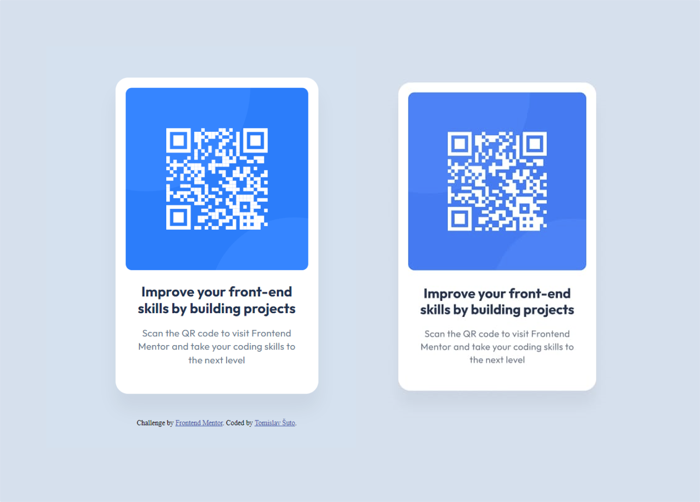

# Frontend Mentor - QR code component solution

This is a solution to the [QR code component challenge on Frontend Mentor](https://www.frontendmentor.io/challenges/qr-code-component-iux_sIO_H). Frontend Mentor challenges help you improve your coding skills by building realistic projects. 

## Table of contents

- [Overview](#overview)
  - [Screenshot](#screenshot)
  - [Links](#links)
- [My process](#my-process)
  - [Built with](#built-with)
  - [What I learned](#what-i-learned)
- [Author](#author)


## Overview

### Screenshot



### Links

- Solution URL: https://github.com/RetroApe/qr-code-component-main
- Live Site URL: https://retroape.github.io/qr-code-component-main

## My process

- Checked design files in Figma
- Used dimensions to sculpt the overall shape
- Went back and forth through HTML & CSS, adding and styling one element at a time
- Adjusting the details until it was as close to the design as possible

### Built with

- HTML
- CSS

### What I learned

- How to use Google Fonts with HTML
- How to use Git through VS Code
- Deploying a website on GitHub
- Centering Vertically & Horizontally 

```css
.container {
    position: absolute;
    top: 50%;
    left: 50%;
    
    /*What -ms- stands for and how it influences transform is what I am confused about*/
    -ms-transform: translate(-50%, -50%);
    transform: translate(-50%, -50%);
}
```

## Author

- Frontend Mentor - [@RetroApe](https://www.frontendmentor.io/profile/RetroApe)
